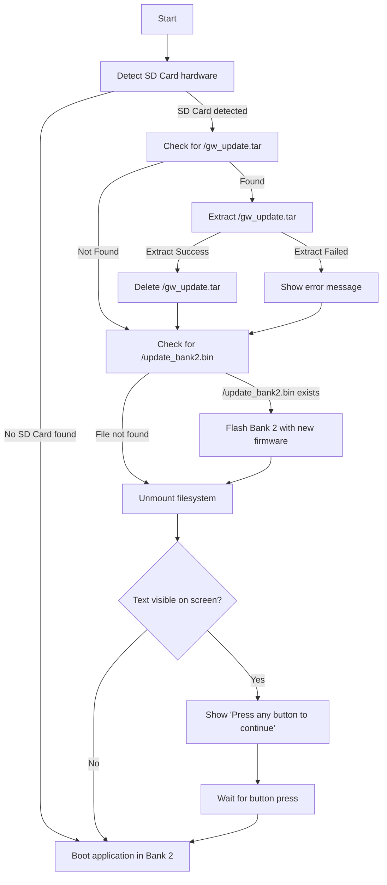

# firmware_update

**firmware_update** is a tool for the Game & Watch console that runs entirely in RAM. This binary is aimed to be loaded by the bootloader available at https://github.com/sylverb/game-and-watch-bootloader

## Features

This application is detecting if an update file is present on the sd card and will install everything, giving information to the user about update progress. It handles update of files on the sd card and internal flash bank 2



## Getting Started

### Building the Project

Clone the repository:
   ```bash
   git clone https://github.com/sylverb/firmware_update.git
   cd firmware_update
   make
```

On macos you may have to run
   ```bash
   make download_sdk
```
before the make

To upload built file to the sd card using jtag, run
   ```bash
   make sdpush```